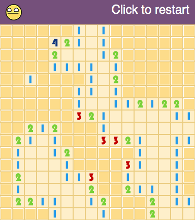

# Minesweeper

The game of Minesweeper written in Elm

## Demo

[Live demo](http://sekibomazic.github.io/minesweeper/)

## How to run

* `fork` this repo
* `git clone` your fork
* `cd /path/to/your/clone`
* run `elm reactor` to start the server
* point the browser to `http://localhost:8000/Minesweeper.elm`

## Optimization

Currently using `List` for the mine field. This was for the learning purpose.

Maybe switch to `Array` or even use some Elm matrix library.

## TODO

* Implement a way to flag mines
* Implement arbitrary board size
* Add more levels
